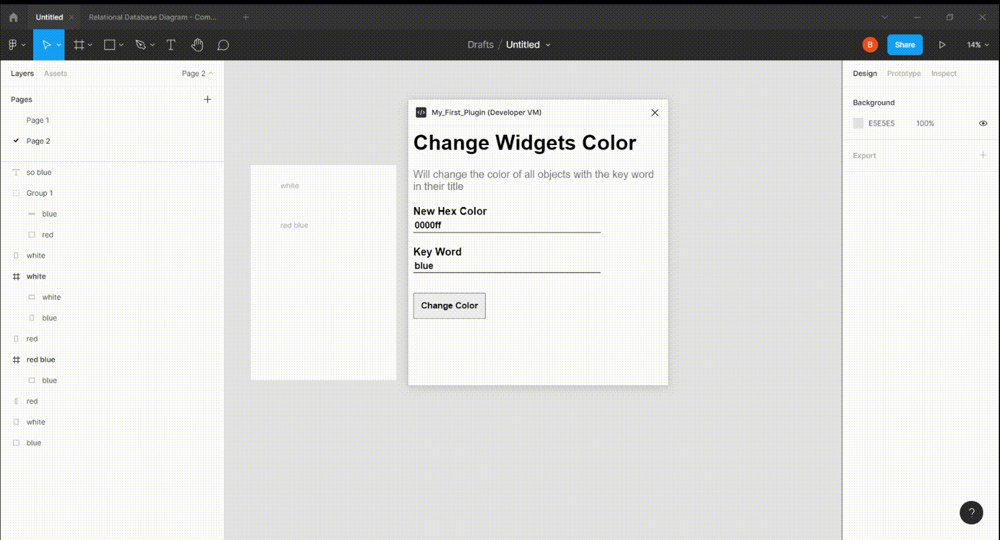

<h1>
  Figma_Update_All_Colors_Plugins
</h1>
<a href = "https://medium.com/@bbrenng1/become-a-figma-developer-create-your-first-plugin-691a87c1daf7">
  Tutorial for plugin
</a>

  A plugin that will scan a Figma file and replace the swap the color of all objects with a user specified keyword in their title.

